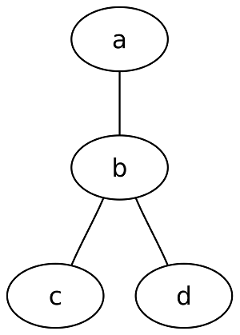

# Dot 

A graph described in **DOT** is usually a text file with a .gv or .dot extension in a format readable by humans and the processing program.

Graphs described in the DOT language are represented graphically using special programs, such as **Graphviz**.

## Example of an undirected graph in the DOT language

An undirected graph in DOT is described by a list of vertices and edges represented by the name of vertices, and a double dash (--) between connected vertices.

```dot
graph graphname {
    a;
    b;
    c;
    d;
    a -- b;
    b -- c;
    b -- d;
}
```

Or equivalently, by leaving out excessive descriptions:

```dot
graph graphname {
     a -- b -- c;
     b -- d;
}
```

## Example of a directed graph in the DOT language

A directed graph in DOT is described by a list of vertices and edges, represented by the names of vertices, and a dash with triangular bracket - arrow (->), between the connected vertices:

```dot
digraph graphname {
     a -> b -> c;
     b -> d;
}
```

Or with excessive descriptions:

```dot
digraph graphname {
    a;
    b;
    c;
    d;
    a -> b;
    b -> c;
    b -> d;
}
```

